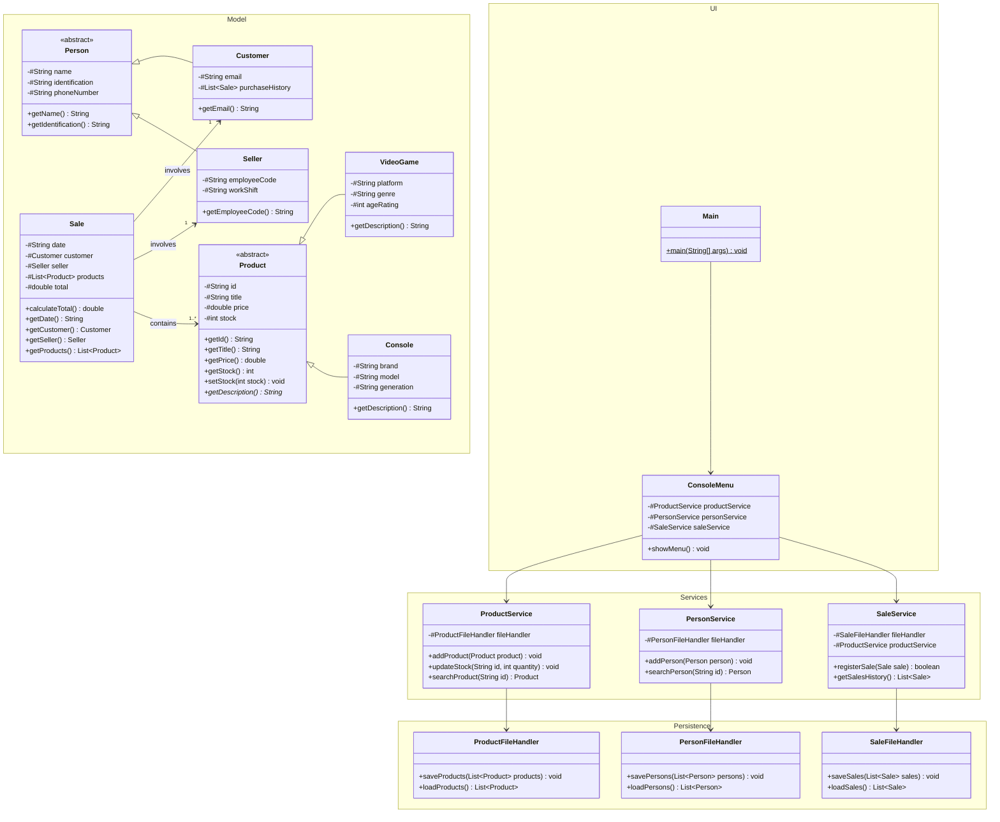

```mermaid
classDiagram
    direction TB

    namespace Model {
        class Product {
            <<abstract>>
            -#String id
            -#String title
            -#double price
            -#int stock
            +getId() String
            +getTitle() String
            +getPrice() double
            +getStock() int
            +setStock(int stock) void
            +getDescription()* String
        }

        class VideoGame {
            -#String platform
            -#String genre
            -#int ageRating
            +getDescription() String
        }

        class Console {
            -#String brand
            -#String model
            -#String generation
            +getDescription() String
        }

        class Person {
            <<abstract>>
            -#String name
            -#String identification
            -#String phoneNumber
            +getName() String
            +getIdentification() String
        }

        class Customer {
            -#String email
            -#List~Sale~ purchaseHistory
            +getEmail() String
        }

        class Seller {
            -#String employeeCode
            -#String workShift
            +getEmployeeCode() String
        }

        class Sale {
            -#String date
            -#Customer customer
            -#Seller seller
            -#List~Product~ products
            -#double total
            +calculateTotal() double
            +getDate() String
            +getCustomer() Customer
            +getSeller() Seller
            +getProducts() List~Product~
        }
    }

    namespace Persistence {
        class ProductFileHandler {
            +saveProducts(List~Product~ products) void
            +loadProducts() List~Product~
        }
        class PersonFileHandler {
            +savePersons(List~Person~ persons) void
            +loadPersons() List~Person~
        }
        class SaleFileHandler {
            +saveSales(List~Sale~ sales) void
            +loadSales() List~Sale~
        }
    }

    namespace Services {
        class ProductService {
            -#ProductFileHandler fileHandler
            +addProduct(Product product) void
            +updateStock(String id, int quantity) void
            +searchProduct(String id) Product
        }
        class PersonService {
            -#PersonFileHandler fileHandler
            +addPerson(Person person) void
            +searchPerson(String id) Person
        }
        class SaleService {
            -#SaleFileHandler fileHandler
            -#ProductService productService
            +registerSale(Sale sale) boolean
            +getSalesHistory() List~Sale~
        }
    }

    namespace UI {
        class ConsoleMenu {
            -#ProductService productService
            -#PersonService personService
            -#SaleService saleService
            +showMenu() void
        }
        class Main {
            +main(String[] args)$ void
        }
    }

    Product <|-- VideoGame
    Product <|-- Console
    Person <|-- Customer
    Person <|-- Seller

    Sale --> "1" Customer : involves
    Sale --> "1" Seller : involves
    Sale --> "1..*" Product : contains

    ProductService --> ProductFileHandler
    PersonService --> PersonFileHandler
    SaleService --> SaleFileHandler

    ConsoleMenu --> ProductService
    ConsoleMenu --> PersonService
    ConsoleMenu --> SaleService
    Main --> ConsoleMenu
```