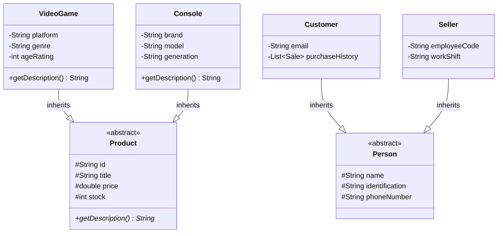

```mermaid
classDiagram
direction BT

    class Product {
        <<abstract>>
        #String id
        #String title
        #double price
        #int stock
        +getDescription()* String
    }

    class VideoGame {
        -String platform
        -String genre
        -int ageRating
        +getDescription() String
    }

    class Console {
        -String brand
        -String model
        -String generation
        +getDescription() String
    }

    class Person {
        <<abstract>>
        #String name
        #String identification
        #String phoneNumber
    }

    class Customer {
        -String email
        -List~Sale~ purchaseHistory
    }

    class Seller {
        -String employeeCode
        -String workShift
    }

    Product <|-- VideoGame : inherits
    Product <|-- Console : inherits
    Person <|-- Customer : inherits
    Person <|-- Seller : inherits
```