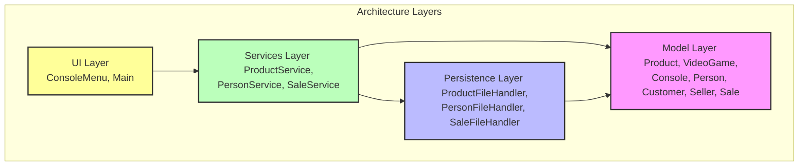

```mermaid
graph TD
    UI[UI Layer <br> ConsoleMenu, Main] --> Services[Services Layer <br> ProductService, PersonService, SaleService]
    
    Services --> Model[Model Layer <br> Product, VideoGame, Console, Person, Customer, Seller, Sale]
    Services --> Persistence[Persistence Layer <br> ProductFileHandler, PersonFileHandler, SaleFileHandler]
    
    Persistence --> Model

    subgraph Architecture Layers
        UI
        Services
        Persistence
        Model
    end

    style Model fill:#f9f,stroke:#333,stroke-width:2px
    style Persistence fill:#bbf,stroke:#333,stroke-width:2px
    style Services fill:#bfb,stroke:#333,stroke-width:2px
    style UI fill:#ff9,stroke:#333,stroke-width:2px
```